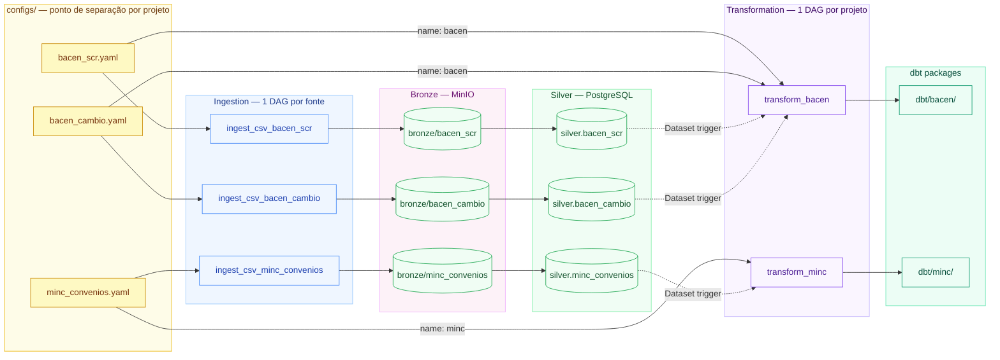

# Pipeline — Separação por Projeto

O **YAML é o único ponto onde a fonte é associada a um projeto** (`dbt_packages.name`).
A ingestão não conhece "projeto" — ela só grava em `silver.<source_name>`.
O `transformation_dag_factory.py` lê todos os YAMLs, agrupa por `dbt_packages.name`,
e gera um DAG dbt por projeto.

