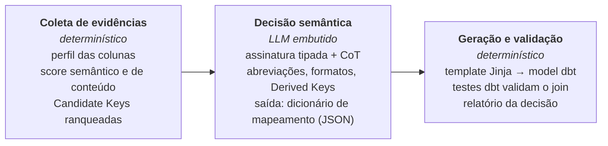
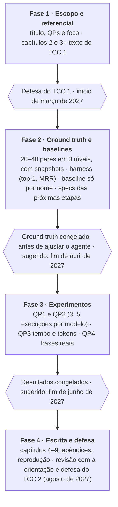

# Proposta de TCC — Integração de dados governamentais com modelos de linguagem

Autora: Luiza Maluf (UnB/FCTE) · Orientação: Carla Rocha e Isaque Alves · versão de 2026-09-28 · documento vivo, atualizar junto com as decisões.

**Calendário:** defesa do TCC 1 no início de março de 2027; defesa do TCC 2 em agosto de 2027.

Artigo-base: ver [`artigo-base.md`](artigo-base.md). Decisões de arquitetura: [`docs/adr/`](../adr/).

## Visão geral

O repositório sustenta um TCC de **engenharia de dados aplicada ao setor público**. A contribuição central é uma arquitetura *config-driven* em que uma fonte governamental nova custa **um único YAML** da ingestão à integração, e em que um modelo de linguagem ajuda a descobrir como cruzar bases heterogêneas.

**Títulos provisórios** (escolher um):

1. Integração semântica orientada a configuração de bases de dados governamentais com apoio de modelos de linguagem
2. Do YAML à chave de integração: uma arquitetura config-driven para ingestão, transformação e integração de dados públicos
3. Descoberta automática de chaves de integração entre bases orçamentárias federais com LLMs

**Problema.** Bases do governo federal (SIAFI, Transferegov, Portal da Transparência, IBGE) usam nomes, formatos e identificadores diferentes para os mesmos conceitos — por exemplo, a Nota de Empenho no formato curto `2023NE000123` e o identificador SIAFI completo. Cruzar essas bases exige conhecimento de domínio e trabalho manual a cada nova fonte: exportar CSV, escrever SQL no dbt, descobrir a chave de junção à mão.

**Tese.** Como no SPAPI-Tester (artigo-base), o LLM não substitui o pipeline: entra só na etapa que exige julgamento — o de-para entre bases — e devolve dados estruturados para estágios determinísticos. Somado a um contrato de configuração (Source Registry) que atravessa as três camadas, isso reduz o custo de integrar uma fonte nova a declará-la.

## Artigo-base: SPAPI-Tester

*Automating a Complete Software Test Process Using LLMs: An Automotive Case Study* (Wang, Yu, Feldt e Parthasarathy; Chalmers e Volvo Group) resolve em testes automotivos o mesmo problema que este repo resolve em dados públicos: um "de-para" entre fontes em silos que só especialistas experientes faziam. O TCC segue o artigo em três pontos: a tese (LLM embutido no processo, não no lugar dele), a arquitetura e o desenho da avaliação. Resumo completo em [`artigo-base.md`](artigo-base.md).

| Aspecto | No artigo | No TCC |
| --- | --- | --- |
| Domínio | Testes de APIs de caminhões (Volvo) | Integração de bases do governo federal |
| Fontes em silos | Swagger, tabelas de sinais CAN, Veículo Virtual | SIAFI, Transferegov, Portal da Transparência, IBGE |
| O "de-para" | Propriedade da API → sinal CAN → estado do veículo virtual | Coluna da base A → coluna da base B (Integration Key) |
| Atritos | Erros ortográficos, abreviações (`STANDARD` → `STD`), formatos, equivalências lógicas (`OFF` = `NOT_ON`), semânticas, unidades, pseudocódigo | Ver **Categoria de atrito** em [`CONTEXT.md`](../../CONTEXT.md) |
| Uso do LLM | DSPy: assinatura tipada, `ChainOfThought`, autocorreção quando o parsing falha | `llm_reasoner` hoje usa prompt direto; migrar para DSPy (ADR 0011) |
| Saída do LLM | Dicionário JSON unificado; o LLM nunca escreve o teste | Integration Key + transformações em JSON; o LLM nunca escreve o SQL |
| Estágio determinístico | Templates Jinja → script PyTest | Templates Jinja → model dbt de join + testes dbt |
| Avaliação | Tempo por API (engenheiro × ferramenta), cobertura, taxa de sucesso por modelo, precisão por categoria de atrito, APIs reais e bugs encontrados | Tempo por par (analista × pipeline), acurácia por modelo, acurácia por categoria de atrito, pares reais e inconsistências encontradas |

O LLM decide o de-para e devolve dados estruturados; quem gera e executa o SQL é código determinístico, como o Jinja e o PyTest no artigo.

**Números do artigo.** A apresentação de referência cita, por exemplo, 11 s por API contra 2 h a 3 dias, taxa de sucesso de 98% e 193 APIs com 22 bugs. Citar esses valores a partir do artigo, não dos slides, e confirmar ano e veículo de publicação.

## Questões de pesquisa e objetivos

| Questão | Pergunta | Como responder | No artigo |
| --- | --- | --- | --- |
| QP1 | Com que acurácia o LLM embutido resolve o de-para entre bases governamentais, por categoria de atrito? | Pares com chave conhecida, cada um rotulado com sua categoria de atrito | Precisão por categoria (ortografia, lógica, unidades, pseudocódigo) |
| QP2 | Um modelo de pesos abertos hospedado localmente alcança um modelo proprietário? | Os mesmos pares com 2 ou 3 modelos, ao menos um aberto | LLaMA3 70B no nível do GPT-4o; para governo, pesa por soberania de dados e LGPD |
| QP3 | Quanto tempo o pipeline economiza frente ao analista, e a que custo? | Tempo por par (analista × pipeline), `timings_s`, tokens; esforço para adicionar fonte antes e depois das costuras | Tempo por API: engenheiro sênior × ferramenta |
| QP4 | O pipeline encontra problemas reais nas bases? | Rodar em pares reais do GovHub e contar inconsistências confirmadas | APIs inéditas testadas e bugs genuínos encontrados |
| QP5 | O Spec-Driven Development (SDD) permite que um agente de IA construa e estenda o pipeline com qualidade verificável? | Cada incremento começa por uma spec com critérios de aceite; registrar critérios atendidos, iterações e intervenções manuais | — (o artigo preserva o processo e embute o LLM nele; o SDD faz o mesmo no desenvolvimento: a spec é a estrutura, o agente implementa) |

**Objetivo geral.** Propor, implementar e avaliar uma arquitetura config-driven de três camadas que integre bases governamentais heterogêneas, usando modelos de linguagem embutidos no processo para descobrir chaves de integração.

**Objetivos específicos:**

1. Definir o Source Registry como contrato entre ingestão, transformação e integração (ADR 0008).
2. Implementar as costuras entre as camadas: sincronização silver, geração do dbt, leitura do banco (ADRs 0009 e 0010).
3. Implementar a Decision Layer com evidências semânticas, estatísticas e de conteúdo e um LLM embutido via DSPy (assinatura tipada, ChainOfThought, autocorreção), incluindo Derived Keys (ADR 0011).
4. Construir um conjunto de pares de bases com chave conhecida (ground truth), rotulados por categoria de atrito.
5. Avaliar acurácia, comparação entre modelos, tempo/custo e aplicação em bases reais, contra baselines.
6. Construir o artefato por Spec-Driven Development com agente de IA e avaliar esse processo (QP5).

**Contribuições esperadas:**

- Arquitetura aberta e reproduzível para dados governamentais, com decisões registradas em ADRs.
- Gerador de sources e models dbt a partir do Source Registry, e não por introspecção do banco.
- Benchmark pequeno de chaves de integração em bases públicas brasileiras, rotulado por categoria de atrito.
- Replicação do método do SPAPI-Tester em outro domínio (dados públicos), com evidência de quando o LLM ajuda e quando não.
- Relato avaliado de SDD com agente de IA na construção de um pipeline de dados, com specs, critérios de aceite e métricas por incremento.

## Estrutura da monografia

| Cap. | Título | Conteúdo | Material no repo |
| --- | --- | --- | --- |
| 1 | Introdução | Contexto, problema, justificativa, QPs, objetivos, contribuições | `README.md`, `docs/tcc/index.html` |
| 2 | Fundamentação teórica | Integração de dados, schema matching, perfilamento, LLMs, arquitetura de dados, dados abertos, Spec-Driven Development | Seção de referencial abaixo |
| 3 | Trabalhos relacionados | Matching, LLMs para dados, artigo-base; tabela comparativa | `docs/tcc/artigo-base.md` |
| 4 | Metodologia | DSR com estudo de caso; SDD como processo de construção; ciclos, PoC IBGE, protocolo de avaliação | `docs/specs/`, histórico de commits |
| 5 | Arquitetura proposta | Três camadas, Source Registry, costuras A/B/C, Context Store, Decision Layer com LLM embutido | `docs/architecture/`, ADRs 0001–0011, `CONTEXT.md` |
| 6 | Implementação | Stack (Airflow, MinIO, DuckDB, dbt, PostgreSQL, LLM), módulos, testes, reprodutibilidade | `src/govhub/`, `tests/`, `docker-compose.yml` |
| 7 | Avaliação e resultados | QP1 acurácia por categoria de atrito, QP2 modelos abertos × proprietários, QP3 tempo e custo, QP4 bases reais, QP5 SDD | `govhub.sync.e2e` (tempos), resultados JSON |
| 8 | Discussão | Achados, limitações, ameaças à validade, implicações para o GovHub | — |
| 9 | Conclusão | Respostas às QPs, contribuições, trabalhos futuros | — |

**Apêndices:** glossário (de `CONTEXT.md`), ADRs, contrato do YAML, prompts/assinaturas da Decision Layer, instruções de reprodução.

Achado de ancoragem para o capítulo 7: no par IBGE sem LLM, a Decision Layer escolheu `nome ↔ nome`. A chave correta é o código da UF (prefixo do código do município e também aninhado no JSON) — um caso de Derived Key em que a comparação com e sem LLM deve mostrar diferença.

## Referencial teórico

Referências clássicas por eixo, listadas de memória: **confirmar autor, ano e veículo antes de citar**, e complementar com trabalhos de 2023 em diante sobre LLMs e matching.

| Eixo | Referência | Para que serve no TCC |
| --- | --- | --- |
| Artigo-base | Wang, Yu, Feldt e Parthasarathy, *Automating a Complete Software Test Process Using LLMs: An Automotive Case Study* (confirmar ano e veículo) | Modelo da tese, da arquitetura e da avaliação |
| LLMs como programa | Khattab et al. (2024), *DSPy: Compiling Declarative Language Model Calls into Self-Improving Pipelines*, ICLR | Assinaturas tipadas, `ChainOfThought` e saída estruturada na Decision Layer |
| Integração de dados | Lenzerini (2002), *Data integration: a theoretical perspective*, PODS | Definição formal de integração |
| Integração de dados | Doan, Halevy e Ives (2012), *Principles of Data Integration*, Morgan Kaufmann | Livro-texto: matching, mapeamento, heterogeneidade |
| Integração de dados | Halevy, Rajaraman e Ordille (2006), *Data integration: the teenage years*, VLDB | Panorama e desafios abertos |
| Schema matching | Rahm e Bernstein (2001), *A survey of approaches to automatic schema matching*, VLDB Journal | Taxonomia schema-based × instance-based das evidências |
| Schema matching | Madhavan, Bernstein e Rahm (2001), *Generic schema matching with Cupid*, VLDB | Matching por nome e estrutura (score semântico) |
| Schema matching | Melnik, Garcia-Molina e Rahm (2002), *Similarity Flooding*, ICDE | Contraste com a abordagem do TCC |
| Descoberta de dados | Koutras et al. (2021), *Valentine*, ICDE | Benchmark e baselines de matching |
| Descoberta de dados | Fernandez et al. (2018), *Aurum*, ICDE | Descoberta de tabelas relacionadas |
| Perfilamento | Abedjan, Golab e Naumann (2015), *Profiling relational data: a survey*, VLDB Journal | Base do `analisar-tabela` |
| Record linkage | Fellegi e Sunter (1969), *A theory for record linkage*, JASA | Distingue chave de integração de linkage de registros |
| Record linkage | Christen (2012), *Data Matching*, Springer | Normalização de identificadores |
| LLMs | Brown et al. (2020), *Language models are few-shot learners*, NeurIPS | Aprendizado em contexto |
| LLMs | Narayan et al. (2022), *Can foundation models wrangle your data?*, PVLDB | LLMs em tarefas de dados |
| LLMs | Wei et al. (2022), *Chain-of-thought prompting*, NeurIPS | Raciocínio registrado na Decision Layer |
| LLMs | Lewis et al. (2020), *Retrieval-augmented generation*, NeurIPS | Domain Context como conhecimento injetado |
| Arquitetura de dados | Kimball e Ross (2013), *The Data Warehouse Toolkit*, 3ª ed. | Camada gold |
| Arquitetura de dados | Armbrust et al. (2021), *Lakehouse*, CIDR | Camadas bronze/silver/gold |
| Arquitetura de dados | Reis e Housley (2022), *Fundamentals of Data Engineering* | Ciclo de vida, orquestração, ELT |
| Arquitetura de dados | Kleppmann (2017), *Designing Data-Intensive Applications* | Idempotência (costura A) |
| Spec-Driven Development | Böckeler (2025), *Understanding Spec-Driven-Development: Kiro, spec-kit, and Tessl*, martinfowler.com | Panorama e críticas do SDD com agentes de IA |
| Spec-Driven Development | GitHub (2025), *Spec Kit*, github.com/github/spec-kit | Fluxo de referência spec → plano → tarefas → implementação |
| Especificação | Meyer (1992), *Applying "Design by Contract"*, IEEE Computer | Contrato como especificação verificável |
| Especificação | Adzic (2011), *Specification by Example*, Manning | Critérios de aceite como exemplos verificáveis |
| Eng. de software | Evans (2003), *Domain-Driven Design* | Linguagem ubíqua (`CONTEXT.md`) |
| Eng. de software | Nygard (2011), *Documenting Architecture Decisions* | Formato de ADR |
| Metodologia | Hevner et al. (2004), MIS Quarterly; Peffers et al. (2007), JMIS; Wieringa (2014) | Design Science Research |
| Metodologia | Wohlin et al. (2012), *Experimentation in Software Engineering* | Ameaças à validade |
| Governo e dados abertos | Lei 12.527/2011 (LAI), Decreto 8.777/2016, Lei 14.129/2021, Lei 13.709/2018 (LGPD) | Marco legal e limites |
| Governo e dados abertos | Janssen, Charalabidis e Zuiderwijk (2012), Information Systems Management | Barreiras ao uso de dados abertos |
| Domínio orçamentário | Documentação do SIAFI, Tesouro Nacional, Portal da Transparência, Transferegov | Formatos de NE, UG, convênio |

Citados pelo artigo-base (área de testes; usar só se o TCC discutir o paralelo): Kim et al., *Leveraging Large Language Models to Improve REST API Testing*; Golmohammadi, Zhang e Arcuri, *Testing RESTful APIs: A Survey*; Zhang, Marculescu e Arcuri, *Resource-based Test Case Generation for RESTful Web Services*.

Onde buscar o que falta: VLDB, SIGMOD, ICDE (LLMs para matching); ICSE, FSE e arXiv (SDD e agentes de IA de código — literatura acadêmica ainda escassa); SBBD e BDBComp (trabalhos brasileiros); Portal de Periódicos CAPES.

## Trabalhos relacionados e posicionamento

O diferencial não é um matcher melhor, e sim juntar o que costuma aparecer separado: pipeline de ponta a ponta, configuração como fonte da verdade e LLM embutido com conhecimento do domínio público brasileiro.

| Abordagem | Exemplo | Descobre a chave | Usa conteúdo (valores) | Usa LLM | Ponta a ponta | Config-driven |
| --- | --- | --- | --- | --- | --- | --- |
| Matchers clássicos | Cupid, Similarity Flooding | Sim (esquema) | Parcial | Não | Não | Não |
| Benchmarks de matching | Valentine | Avalia | Sim | Não | Não | Não |
| Descoberta em data lakes | Aurum | Tabelas relacionadas | Sim | Não | Não | Não |
| LLMs para dados | Narayan et al. (2022) | Sim (tarefa isolada) | Sim | Sim | Não | Não |
| LLM embutido em processo industrial | SPAPI-Tester (artigo-base) | De-para entre documentos | Não (documentação) | Sim | Sim | Parcial (templates) |
| Geração de código dbt | dbt-codegen | Não | Não (introspecção) | Não | Parcial | Não |
| **Este TCC** | GovHub | Sim, com Derived Keys | Sim | Sim | Sim | Sim |

Posicionar pela combinação e pelo domínio, não por "não existe nada igual".

## Metodologia

**Design Science Research com estudo de caso**, como no artigo-base: a DSR organiza construção e avaliação do artefato; o estudo de caso real (bases do GovHub) dá a validação fora do ambiente controlado. O histórico do repo registra os ciclos (PoC IBGE → costuras → validação no ambiente do container) e as ADRs registram as decisões. Princípio adotado do artigo: o LLM entra sem mudar o fluxo de trabalho do analista, só automatiza as etapas de tradução.

**Spec-Driven Development (SDD) como foco do processo.** A DSR é o método de pesquisa; o SDD é como o artefato é construído e também objeto de avaliação (QP5). Cada ciclo segue: (1) spec em `docs/specs/` com problema, escopo, contrato e critérios de aceite verificáveis (modelo em `docs/specs/_template.md`); (2) plano; (3) implementação por agente de IA a partir da spec; (4) validação contra os critérios e os testes; (5) ADR quando há decisão de arquitetura. A spec cumpre no desenvolvimento o papel que o processo estruturado cumpre no artigo-base: é a estrutura fixa, e o agente só preenche a implementação.

| QP | Experimento | Métricas | Baseline |
| --- | --- | --- | --- |
| QP1 | Decision Layer em pares com chave conhecida, rotulados por categoria de atrito | Acurácia top-1 e MRR, geral e por categoria; acerto de Derived Keys | (a) só similaridade de nome; (b) pipeline sem LLM; (c) com LLM |
| QP2 | QP1 com 2 ou 3 modelos, ao menos um de pesos abertos rodando localmente | Taxa de sucesso por modelo, tokens, latência | Modelo proprietário |
| QP3 | Analista resolvendo uma amostra de pares à mão, cronometrado, e o pipeline nos mesmos pares | Tempo por par, acurácia analista × pipeline | Analista; fluxo antigo (CSV + dbt manual) |
| QP4 | Pipeline aplicado a pares reais ainda não integrados no GovHub | Pares integrados, inconsistências confirmadas com quem conhece a base | — |
| QP5 | Cada incremento restante (DSPy, estágio Jinja → dbt, harness, novas fontes) construído por SDD, com o registro da spec preenchido | Critérios de aceite atendidos na primeira implementação, iterações spec ↔ código, intervenções manuais, mudanças na spec após aprovada, testes passando, divergências spec × código | Incrementos anteriores sem spec formal, no histórico do repo, quando comparáveis |

**Ground truth.** 20 a 40 pares de tabelas públicas com a chave anotada à mão e justificativa escrita, em três níveis (fácil: mesmo nome e formato; médio: nome diferente, mesmo conteúdo; difícil: Derived Key) e rotulados por categoria de atrito. Incluir pares negativos (sem chave). Se possível, segunda pessoa revisa uma amostra e reporta-se a concordância. **Congelar antes de ajustar o agente.**

**Não determinismo do LLM.** 3 a 5 execuções por par, temperatura e versão do modelo fixas, média e desvio reportados; prompts/assinaturas e respostas versionados.

## Lacunas e plano de trabalho

O sistema funciona de ponta a ponta (costuras A/B/C, `docs/specs/costuras-e2e.md`). O que falta para virar TCC é avaliação:

- **Ground truth** rotulado por categoria de atrito; hoje só há o par IBGE e fixtures de teste.
- **Harness de avaliação**: script que roda a Decision Layer nos pares e calcula top-1, top-3 e MRR.
- **Baseline só por nome**: opção no `IntegrationAgent` que desliga as evidências de conteúdo.
- **Custo do LLM**: o `llm_reasoner` não registra tokens nem latência.
- **Dados reais congelados**: snapshots datados de IBGE, SIAFI e Transferegov.
- **Execução real no Docker** (`make up`) com a API do IBGE ao vivo.

Para seguir o artigo-base (ADR 0011):

- **DSPy na Decision Layer**: assinatura tipada com `ChainOfThought`, saída validada e nova chamada quando o parsing falhar.
- **Estágio Jinja → dbt**: gerar o model de join e os testes dbt a partir do dicionário de mapeamento, como o gerador de sources já faz para o bronze.
- **Troca de modelo por configuração**: um proprietário e um de pesos abertos local, sem mudar código.
- **Estudo de tempo com analista.**

Para a QP5 (SDD):

- **Spec antes do código** em cada incremento acima, a partir de `docs/specs/_template.md`, com a seção de registro preenchida ao final.
- **Specs existentes** (`costuras-e2e.md`, PRDs) revisadas para o mesmo formato, para servir de linha de base.

O portão que decide o cronograma é o ground truth: congelar os pares antes de mexer no agente, senão a avaliação mede o próprio ajuste.

## Riscos, ameaças à validade e decisões em aberto

| Risco | Efeito | Mitigação |
| --- | --- | --- |
| A autora escreve a spec, orienta o agente e avalia o resultado (QP5) | Viés a favor do SDD | Critérios de aceite escritos antes e verificados por testes automatizados; registro por incremento, inclusive dos que falharam |
| Ground truth pequeno ou enviesado para o que o agente já acerta | Acurácia inflada | Montar os pares antes de ajustar o agente; incluir casos difíceis e negativos |
| LLM não determinístico e modelo que muda de versão | Resultados não reproduzíveis | Fixar versão e temperatura, repetir execuções, versionar prompts e respostas |
| Contaminação: o modelo pode conhecer SIAFI/IBGE do pré-treino | Superestima a generalização | Incluir pares com colunas renomeadas ou anonimizadas |
| APIs públicas instáveis ou com limite de acesso | Atrasos na coleta | Congelar snapshots datados |
| Dados pessoais (ex.: SIAPE) | Risco LGPD | Usar bases agregadas/públicas; não versionar dados pessoais |
| Escopo crescer (PDF, DAG factory, dashboards) | TCC não fecha | Congelar escopo: ingestão API/CSV + costuras + Decision Layer |

**Ameaças à validade** (Wohlin et al., 2012): *interna* — a autora constrói o agente e anota o ground truth; *externa* — domínio orçamentário federal; *de constructo* — acurácia top-1 não mede utilidade para o analista; *de conclusão* — amostra pequena de pares.

**Decisões em aberto:**

- [ ] Título (três opções na visão geral)
- [x] Orientação: Carla Rocha e Isaque Alves
- [ ] Tamanho do ground truth e quais bases entram
- [ ] Quais LLMs e versões fixar (um proprietário, um de pesos abertos) e orçamento de tokens
- [ ] Peso relativo entre arquitetura (costuras) e Decision Layer (QP1–QP2)
- [ ] Ferramenta de SDD (fluxo próprio com Claude Code ou Spec Kit) e se a QP5 terá comparação sem spec
- [x] Datas: TCC 1 no início de março de 2027; TCC 2 em agosto de 2027
