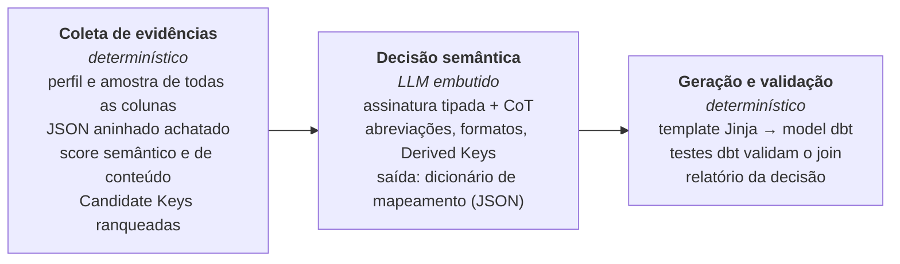
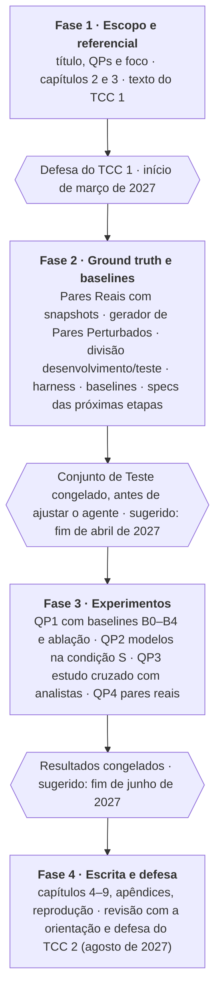

# Proposta de TCC — Integração de dados públicos com modelos de linguagem

Autora: Luiza Maluf (UnB/FCTE) · Orientação: Carla Rocha e Isaque Alves · versão de 2026-10-03 · documento vivo, atualizar junto com as decisões.

**Calendário:** defesa do TCC 1 no início de março de 2027; defesa do TCC 2 em agosto de 2027.

Artigo-base: ver [`artigo-base.md`](artigo-base.md). Decisões de arquitetura: [`docs/adr/`](../adr/).

## Visão geral

**Título:** *Integração de dados públicos com modelos de linguagem: um pipeline construído por Spec-Driven Development para descoberta de chaves entre bases governamentais*

O repositório sustenta um TCC de **engenharia de dados aplicada ao setor público** com dois pilares: (1) um pipeline em que um modelo de linguagem, embutido entre estágios determinísticos, descobre chaves de integração entre bases governamentais; (2) a construção desse pipeline por **Spec-Driven Development** com agente de IA, avaliada como parte da pesquisa.

**Motivação: interoperabilidade.** Bases do governo federal (SIAFI, Transferegov, Portal da Transparência, IBGE) têm baixa interoperabilidade semântica: usam nomes, formatos e identificadores diferentes para os mesmos conceitos — por exemplo, a Nota de Empenho no formato curto `2023NE000123` e o identificador SIAFI completo — e raramente declaram uma chave comum.

**Problema.** Por isso, cruzar duas bases exige descobrir a chave de junção à mão, com conhecimento de domínio, a cada novo par de bases.

**Tese.** Como no SPAPI-Tester (artigo-base), o LLM não substitui o pipeline: entra só na etapa que exige julgamento — o de-para entre bases — e devolve dados estruturados para estágios determinísticos. O mesmo princípio vale para a construção do pipeline: no SDD, a spec é a estrutura fixa e o agente de IA só preenche a implementação.

**Fora do foco.** A ingestão das bases é feita pelo GovHub (`data-application-gov-hub`), que já carrega os sistemas em schemas do PostgreSQL; este repositório lê de lá (`PostgresLoader`) ou de snapshots datados exportados de lá. A pilha de ingestão própria (Airflow, MinIO, costuras A/B/C) foi removida em 2026-10-03 e está registrada em `docs/historico/` e nas ADRs 0001–0010, descontinuadas.

## Artigo-base: SPAPI-Tester

*Automating a Complete Software Test Process Using LLMs: An Automotive Case Study* (Wang, Yu, Feldt e Parthasarathy; Chalmers e Volvo Group) resolve em testes automotivos o mesmo problema que este repo resolve em dados públicos: um "de-para" entre fontes em silos que só especialistas experientes faziam. O TCC segue o artigo em três pontos: a tese (LLM embutido no processo, não no lugar dele), a arquitetura e o desenho da avaliação. Resumo completo em [`artigo-base.md`](artigo-base.md).

| Aspecto | No artigo | No TCC |
| --- | --- | --- |
| Domínio | Testes de APIs de caminhões (Volvo) | Integração de bases do governo federal |
| Fontes em silos | Swagger, tabelas de sinais CAN, Veículo Virtual | SIAFI, Transferegov, Portal da Transparência, IBGE |
| O "de-para" | Propriedade da API → sinal CAN → estado do veículo virtual | Coluna da base A → coluna da base B (Integration Key) |
| Atritos | Erros ortográficos, abreviações (`STANDARD` → `STD`), formatos, equivalências lógicas (`OFF` = `NOT_ON`), semânticas, unidades, pseudocódigo | Ver **Categoria de atrito** em [`CONTEXT.md`](../../CONTEXT.md); sem a categoria de unidades, que não aparece em chaves, e com Derived Key e Estrutura aninhada, que o artigo não tem |
| Escopo do de-para | Todas as propriedades da API | Só a Integration Key; o mapeamento das demais colunas equivalentes fica como trabalho futuro |
| Uso do LLM | DSPy: assinatura tipada, `ChainOfThought`, autocorreção quando o parsing falha | `llm_reasoner` hoje usa prompt direto; migrar para DSPy (ADR 0011) |
| Saída do LLM | Dicionário JSON unificado, com mapeamento de valores; o LLM nunca escreve o teste | Integration Key + transformações do Catálogo de Transformações (fechado); o LLM nunca escreve o SQL |
| Estágio determinístico | Templates Jinja → script PyTest | Templates Jinja → model dbt de join + testes dbt |
| Avaliação | Tempo por API (engenheiro × ferramenta), cobertura, taxa de sucesso por modelo, precisão por categoria de atrito, APIs reais e bugs encontrados | Tempo e acurácia do analista sozinho × assistido pelo pipeline, acurácia por modelo, acurácia por categoria de atrito, pares reais com chave confirmada e barreiras de interoperabilidade encontradas |

O LLM decide o de-para e devolve dados estruturados; quem gera e executa o SQL é código determinístico, como o Jinja e o PyTest no artigo. Como no artigo, o estágio anterior reúne a informação e não filtra as respostas: os Candidate Keys ordenam as opções, mas o LLM pode propor uma chave fora da lista (composta ou derivada), que o estágio determinístico valida executando o join.

**Números do artigo.** A apresentação de referência cita, por exemplo, 11 s por API contra 2 h a 3 dias, taxa de sucesso de 98% e 193 APIs com 22 bugs. Citar esses valores a partir do artigo, não dos slides, e confirmar ano e veículo de publicação.

## Questões de pesquisa e objetivos

| Questão | Pergunta | Como responder | No artigo |
| --- | --- | --- | --- |
| QP1 | Com que acurácia o LLM embutido descobre a Integration Key entre bases governamentais, por categoria de atrito? | Pares de Avaliação com Gabarito, inclusive Pares Negativos, rotulados por categoria de atrito; Acerto de Chave e Acerto de Execução | Precisão por categoria (ortografia, lógica, unidades, pseudocódigo) |
| QP2 | Um modelo de pesos abertos hospedado localmente alcança um modelo proprietário? | Os mesmos pares com 2 ou 3 modelos, ao menos um aberto | LLaMA3 70B no nível do GPT-4o; para governo, pesa por soberania de dados e LGPD |
| QP3 | O pipeline torna o analista mais rápido e mais certeiro na descoberta da chave, e a que custo? | Estudo cruzado: analistas do GovHub resolvem Pares Reais metade sozinhos e metade revisando a saída do pipeline; tempo até declarar a chave e acurácia pelo Gabarito; tokens, latência e custo do pipeline à parte | Tempo por API: engenheiro sênior × ferramenta |
| QP4 | Em pares reais que o GovHub ainda não integra, o pipeline descobre chaves que quem conhece as bases confirma? | Rodar em pares reais novos e contar chaves confirmadas e Abstenções corretas; os achados (Categorias de Atrito encontradas, pares sem chave comum, problemas que aparecem ao executar o join) alimentam a discussão sobre interoperabilidade | APIs inéditas testadas e bugs genuínos encontrados |
| QP5 | O Spec-Driven Development (SDD) permite que um agente de IA construa e estenda o pipeline com qualidade verificável? | Cada incremento avaliado é implementado duas vezes pelo mesmo agente, a partir do mesmo commit — com a spec e sem ela —; testes-oráculo escritos pela autora antes e escondidos do agente medem os dois braços; comparar correção, intervenções e tempo, incluindo o de escrever a spec | — (o artigo preserva o processo e embute o LLM nele; o SDD faz o mesmo no desenvolvimento: a spec é a estrutura, o agente implementa) |

**Objetivo geral.** Propor, implementar por Spec-Driven Development e avaliar um pipeline que use modelos de linguagem embutidos entre estágios determinísticos para descobrir chaves de integração entre bases governamentais heterogêneas.

**Objetivos específicos:**

1. Implementar a Decision Layer com um LLM embutido via DSPy (assinatura tipada, ChainOfThought, autocorreção), com Abstenção, chaves propostas fora da lista de candidatos e Catálogo de Transformações (ADR 0011).
2. Implementar o estágio determinístico que gera, a partir do Dicionário de Mapeamento, o model dbt de join e seus testes.
3. Construir o benchmark de chaves de integração: Pares Reais anotados e gerador de Pares Perturbados, rotulados por categoria de atrito.
4. Avaliar acurácia, comparação entre modelos, tempo e custo e aplicação em pares reais, contra baselines (QP1–QP4).
5. Construir o pipeline por Spec-Driven Development com agente de IA e avaliar esse processo por comparação pareada (QP5).

**Contribuições esperadas:**

- Pipeline aberto e reproduzível de descoberta de chaves com LLM embutido: saída tipada, Catálogo de Transformações e validação por execução, com decisões registradas em ADRs.
- Benchmark de chaves de integração em bases públicas brasileiras, rotulado por categoria de atrito: Pares Reais anotados e um gerador reproduzível de Pares Perturbados.
- Replicação do método do SPAPI-Tester em outro domínio (dados públicos), com evidência de quando o LLM ajuda e quando não.
- Evidência pareada do efeito do SDD com agente de IA na construção de um pipeline de dados (com spec × sem spec, medida por testes-oráculo).

## Estrutura da monografia

| Cap. | Título | Conteúdo | Material no repo |
| --- | --- | --- | --- |
| 1 | Introdução | Motivação (interoperabilidade), problema, justificativa, QPs, objetivos, contribuições | `README.md`, `docs/tcc/index.html` |
| 2 | Fundamentação teórica | Interoperabilidade e dados abertos no setor público, integração de dados, schema matching, perfilamento, LLMs, Spec-Driven Development | Seção de referencial abaixo |
| 3 | Trabalhos relacionados | Matching, LLMs para dados, artigo-base; tabela comparativa | `docs/tcc/artigo-base.md` |
| 4 | Metodologia | DSR com estudo de caso; SDD como processo de construção; ciclos, PoC IBGE, protocolo de avaliação | `docs/specs/`, histórico de commits |
| 5 | Pipeline proposto | Coleta de evidências, Decision Layer com LLM embutido, Dicionário de Mapeamento e Catálogo de Transformações, estágio Jinja → dbt; a ingestão é do GovHub | ADR 0011, `CONTEXT.md` |
| 6 | Implementação | Stack (Python, DSPy, dbt, PostgreSQL, LLM proprietário e de pesos abertos), módulos, testes, reprodutibilidade | `src/govhub/`, `tests/`, `dbt/` |
| 7 | Avaliação e resultados | QP1 acurácia por categoria de atrito, QP2 modelos abertos × proprietários, QP3 tempo e custo, QP4 pares reais, QP5 SDD | Harness de avaliação, resultados JSON, registros das specs |
| 8 | Discussão | Achados, o que eles revelam sobre a interoperabilidade das bases, limitações, ameaças à validade, implicações para o GovHub | — |
| 9 | Conclusão | Respostas às QPs, contribuições, trabalhos futuros | — |

**Apêndices:** glossário (de `CONTEXT.md`), ADRs, Catálogo de Transformações, prompts/assinaturas da Decision Layer, protocolo da QP5 e registros das specs, instruções de reprodução.

Achado de ancoragem para o capítulo 7: no par IBGE sem LLM, a Decision Layer escolheu `nome ↔ nome`. A chave correta é o código da UF (prefixo do código do município e também aninhado no JSON) — um caso de Derived Key em que a comparação com e sem LLM deve mostrar diferença.

## Referencial teórico

Referências clássicas por eixo, listadas de memória: **confirmar autor, ano e veículo antes de citar**, e complementar com trabalhos de 2023 em diante sobre LLMs e matching.

| Eixo | Referência | Para que serve no TCC |
| --- | --- | --- |
| Artigo-base | Wang, Yu, Feldt e Parthasarathy, *Automating a Complete Software Test Process Using LLMs: An Automotive Case Study* (confirmar ano e veículo) | Modelo da tese, da arquitetura e da avaliação |
| LLMs como programa | Khattab et al. (2024), *DSPy: Compiling Declarative Language Model Calls into Self-Improving Pipelines*, ICLR | Assinaturas tipadas, `ChainOfThought` e saída estruturada na Decision Layer |
| Integração de dados | Lenzerini (2002), *Data integration: a theoretical perspective*, PODS | Definição formal de integração |
| Integração de dados | Doan, Halevy e Ives (2012), *Principles of Data Integration*, Morgan Kaufmann | Livro-texto: matching, mapeamento, heterogeneidade |
| Integração de dados | Halevy, Rajaraman e Ordille (2006), *Data integration: the teenage years*, VLDB | Panorama e desafios abertos |
| Schema matching | Rahm e Bernstein (2001), *A survey of approaches to automatic schema matching*, VLDB Journal | Taxonomia schema-based × instance-based das evidências |
| Schema matching | Madhavan, Bernstein e Rahm (2001), *Generic schema matching with Cupid*, VLDB | Matching por nome e estrutura (score semântico) |
| Schema matching | Melnik, Garcia-Molina e Rahm (2002), *Similarity Flooding*, ICDE | Contraste com a abordagem do TCC |
| Descoberta de dados | Koutras et al. (2021), *Valentine*, ICDE | Benchmark, método de geração de pares por perturbação e baseline B1 |
| Schema matching | Do e Rahm (2002), *COMA: a system for flexible combination of schema matching approaches*, VLDB | Método do baseline B1 |
| Descoberta de dados | Fernandez et al. (2018), *Aurum*, ICDE | Descoberta de tabelas relacionadas |
| Perfilamento | Abedjan, Golab e Naumann (2015), *Profiling relational data: a survey*, VLDB Journal | Base do `analisar-tabela` |
| Record linkage | Fellegi e Sunter (1969), *A theory for record linkage*, JASA | Distingue chave de integração de linkage de registros |
| Record linkage | Christen (2012), *Data Matching*, Springer | Normalização de identificadores |
| LLMs | Brown et al. (2020), *Language models are few-shot learners*, NeurIPS | Aprendizado em contexto |
| LLMs | Narayan et al. (2022), *Can foundation models wrangle your data?*, PVLDB | LLMs em tarefas de dados |
| LLMs | Wei et al. (2022), *Chain-of-thought prompting*, NeurIPS | Raciocínio registrado na Decision Layer |
| LLMs | Lewis et al. (2020), *Retrieval-augmented generation*, NeurIPS | Domain Context como conhecimento injetado |
| Engenharia de dados | Reis e Housley (2022), *Fundamentals of Data Engineering* | Contexto: ciclo de vida dos dados, ELT |
| Spec-Driven Development | Böckeler (2025), *Understanding Spec-Driven-Development: Kiro, spec-kit, and Tessl*, martinfowler.com | Panorama e críticas do SDD com agentes de IA |
| Spec-Driven Development | GitHub (2025), *Spec Kit*, github.com/github/spec-kit | Fluxo de referência spec → plano → tarefas → implementação |
| Especificação | Meyer (1992), *Applying "Design by Contract"*, IEEE Computer | Contrato como especificação verificável |
| Especificação | Adzic (2011), *Specification by Example*, Manning | Critérios de aceite como exemplos verificáveis |
| Eng. de software | Evans (2003), *Domain-Driven Design* | Linguagem ubíqua (`CONTEXT.md`) |
| Eng. de software | Nygard (2011), *Documenting Architecture Decisions* | Formato de ADR |
| Metodologia | Hevner et al. (2004), MIS Quarterly; Peffers et al. (2007), JMIS; Wieringa (2014) | Design Science Research |
| Metodologia | Wohlin et al. (2012), *Experimentation in Software Engineering* | Ameaças à validade |
| Estatística | Efron e Tibshirani (1993), *An Introduction to the Bootstrap*; McNemar (1947), Psychometrika; Holm (1979), Scandinavian Journal of Statistics; Wilson (1927), JASA | Plano de análise: bootstrap pareado, McNemar, correção de Holm, intervalo de Wilson |
| Interoperabilidade | Comissão Europeia (2017), *New European Interoperability Framework* (EIF) | Camadas legal, organizacional, semântica e técnica; situa o TCC na camada semântica |
| Interoperabilidade | e-PING — Padrões de Interoperabilidade de Governo Eletrônico (Governo Federal) | Referencial brasileiro de interoperabilidade |
| Interoperabilidade | Decreto 10.046/2019 (governança no compartilhamento de dados) | Compartilhamento de dados na administração federal |
| Governo e dados abertos | Lei 12.527/2011 (LAI), Decreto 8.777/2016, Lei 14.129/2021, Lei 13.709/2018 (LGPD) | Marco legal e limites |
| Governo e dados abertos | Janssen, Charalabidis e Zuiderwijk (2012), Information Systems Management | Barreiras ao uso de dados abertos |
| Domínio orçamentário | Documentação do SIAFI, Tesouro Nacional, Portal da Transparência, Transferegov | Formatos de NE, UG, convênio |

Citados pelo artigo-base (área de testes; usar só se o TCC discutir o paralelo): Kim et al., *Leveraging Large Language Models to Improve REST API Testing*; Golmohammadi, Zhang e Arcuri, *Testing RESTful APIs: A Survey*; Zhang, Marculescu e Arcuri, *Resource-based Test Case Generation for RESTful Web Services*.

Onde buscar o que falta: VLDB, SIGMOD, ICDE (LLMs para matching); ICSE, FSE e arXiv (SDD e agentes de IA de código — literatura acadêmica ainda escassa); SBBD e BDBComp (trabalhos brasileiros); Portal de Periódicos CAPES.

## Trabalhos relacionados e posicionamento

O diferencial não é um matcher melhor, e sim juntar o que costuma aparecer separado: LLM embutido com saída tipada, validação da decisão por execução, avaliação por categoria de atrito em dados públicos brasileiros e um processo de construção (SDD) avaliado junto com o artefato.

| Abordagem | Exemplo | Descobre a chave | Usa conteúdo (valores) | Usa LLM | Valida executando | Processo de construção avaliado |
| --- | --- | --- | --- | --- | --- | --- |
| Matchers clássicos | Cupid, Similarity Flooding, COMA | Sim (esquema) | Parcial | Não | Não | Não |
| Benchmarks de matching | Valentine | Avalia | Sim | Não | Não | Não |
| Descoberta em data lakes | Aurum | Tabelas relacionadas | Sim | Não | Não | Não |
| LLMs para dados | Narayan et al. (2022) | Sim (tarefa isolada) | Sim | Sim | Não | Não |
| LLM embutido em processo industrial | SPAPI-Tester (artigo-base) | De-para entre documentos | Não (documentação) | Sim | Sim (PyTest) | Não |
| **Este TCC** | GovHub | Sim, com Derived Keys | Sim | Sim | Sim (dbt) | Sim (SDD, QP5) |

Posicionar pela combinação e pelo domínio, não por "não existe nada igual".

## Metodologia

**Design Science Research com estudo de caso**, como no artigo-base: a DSR organiza construção e avaliação do artefato; o estudo de caso real (bases do GovHub) dá a validação fora do ambiente controlado. O histórico do repo registra os ciclos (skills da Fase 01 → pacote com Decision Layer → pilha de ingestão própria, depois removida; ver `docs/historico/`) e as ADRs registram as decisões. Princípio adotado do artigo: o LLM entra sem mudar o fluxo de trabalho do analista, só automatiza as etapas de tradução.

**Spec-Driven Development (SDD) como foco do processo.** A DSR é o método de pesquisa; o SDD é como o artefato é construído e também objeto de avaliação (QP5). Cada ciclo segue: (1) spec em `docs/specs/` com problema, escopo, contrato e critérios de aceite verificáveis (modelo em `docs/specs/_template.md`); (2) plano; (3) implementação por agente de IA a partir da spec; (4) validação contra os critérios e os testes; (5) ADR quando há decisão de arquitetura. A spec cumpre no desenvolvimento o papel que o processo estruturado cumpre no artigo-base: é a estrutura fixa, e o agente só preenche a implementação.

**Desenho da QP5: comparação pareada.** Registrar só que "com spec, o agente cumpriu a spec" não mede o efeito do SDD: o agente vê os critérios e escreve os próprios testes, e não há referência do que faria sem spec. Por isso, em cada incremento avaliado:

1. A autora escreve a spec e uma suíte de **testes-oráculo** derivada dos critérios de aceite, antes de qualquer implementação; a suíte fica fora do workspace do agente.
2. O incremento é implementado em dois braços, em worktrees separados a partir do mesmo commit, com o mesmo agente e a mesma versão de modelo, em ordem sorteada: **com spec** (spec completa) e **sem spec** (só a seção *Problema*, como um pedido comum).
3. Intervenções padronizadas: até K rodadas em que a autora só relata o comportamento observado, sem dica de implementação; cada intervenção é registrada literalmente.
4. Os testes-oráculo rodam nos dois braços. Só o braço com spec entra no repositório — o artefato continua construído por SDD.

"Qualidade verificável" passa a ser três medidas: correção (testes-oráculo passando), autonomia (intervenções) e custo (tempo da autora, incluindo escrever a spec, e tokens). O protocolo da QP5 é ele mesmo uma spec em `docs/specs/`, congelada antes do primeiro incremento avaliado, pela mesma lógica do Conjunto de Teste.

| QP | Experimento | Métricas | Baseline |
| --- | --- | --- | --- |
| QP1 | Decision Layer nos Pares de Avaliação, rotulados por categoria de atrito | Cobertura de Candidatos (teto do pipeline sem LLM); Acerto de Chave (top-1) e Acerto de Execução, geral e por categoria; Abstenção correta nos Pares Negativos; fração das chaves certas propostas fora da lista; MRR só para os baselines que produzem ranking | B0 a B4 (abaixo) |
| QP2 | QP1 na condição S com 2 ou 3 modelos, ao menos um de pesos abertos rodando localmente | Taxa de sucesso por modelo, tokens, latência | Modelo proprietário |
| QP3 | Desenho cruzado: 2 ou 3 analistas do GovHub (nunca a autora, sem acesso ao Gabarito) resolvem 6 a 8 Pares Reais do Conjunto de Teste; cada um faz metade sozinho e metade revisando o Dicionário de Mapeamento do pipeline, com a divisão trocada entre analistas para controlar dificuldade do par e aprendizado | Tempo até declarar chave e transformação (teto de 60 min por par; acima disso, "não resolvido"); Acerto de Chave e Acerto de Execução pelo Gabarito; `timings_s`, tokens, custo em R$ do modelo proprietário e tempo de máquina do local | Analista sozinho |
| QP4 | Pipeline aplicado a pares reais ainda não integrados no GovHub | Chaves confirmadas por quem conhece as bases; Abstenções corretas; achados de interoperabilidade (atritos, pares sem chave comum, problemas ao executar o join) para a discussão | — |
| QP5 | Comparação pareada em 6 a 8 incrementos (ex.: Abstenção, Catálogo de Transformações, DSPy, Jinja → dbt, gerador de Pares Perturbados, harness, baselines): o mesmo incremento em dois braços, a partir do mesmo commit, com o mesmo agente e modelo — um recebe a spec completa, o outro só a seção *Problema* | Testes-oráculo passando na primeira entrega e ao final; iterações; intervenções; tokens; tempo da autora, incluindo escrever a spec; análise pareada por incremento (descritiva e Wilcoxon) | Braço sem spec do mesmo incremento |

**Baselines.** A tese tem duas metades — (i) as evidências determinísticas ajudam o LLM; (ii) o LLM é melhor fora do artefato executado — e cada uma tem um baseline que a testa. Todas as condições passam pelo mesmo harness (Acerto de Chave e Acerto de Execução).

| Condição | O que é | O que responde |
| --- | --- | --- |
| B0 · só nome | Similaridade de nome, nada mais | Piso |
| B1 · matcher clássico | Dois métodos do Valentine (COMA e um baseado em valores); a correspondência mais bem ranqueada vale como chave; limiar de Abstenção calibrado no Conjunto de Desenvolvimento | Se o sistema supera o matching clássico; sem transformação, só tem Acerto de Execução quando a chave dispensa transformação |
| B2 · evidências sem LLM | Pipeline sem LLM, com e sem Domain Context | Teto do determinístico (ablação 2 × 2) |
| B3 · LLM sozinho | Mesma assinatura e mesmo catálogo, só com esquema e amostras — sem Candidate Keys nem evidências | Metade (i): as evidências ajudam o LLM? |
| B4 · LLM escreve o SQL | Mesmas entradas de S; o LLM devolve o SQL do join, executado num DuckDB só de leitura sobre os snapshots | Metade (ii): o estágio determinístico ajuda? |
| S · sistema | LLM embutido, com e sem Domain Context | — |

A QP2 compara modelos só na condição S; B3 e B4 rodam com o modelo principal.

**Ground truth.** Benchmark em duas partes. Cada Par de Avaliação tem um Gabarito: o conjunto de Chaves Aceitáveis (colunas de A, colunas de B e transformação), já que um par pode ter mais de uma chave correta. As duas partes incluem Pares Negativos (Gabarito vazio), em que a resposta correta é a Abstenção.

| Parte | Como se monta | Tamanho | Uso |
| --- | --- | --- | --- |
| Pares Reais | Tabelas públicas com relação conhecida (ex.: IBGE municípios × estados, Transferegov × SIAFI, Portal da Transparência × SIAFI), Gabarito anotado à mão com justificativa escrita; uma segunda pessoa revisa uma amostra e reporta-se a concordância | 12 a 20 | Validade externa e base da QP4; vários rótulos por par, resultado reportado no agregado |
| Pares Perturbados | A tabela B é gerada de uma tabela real aplicando **uma** Categoria de Atrito por vez à chave (renomear, abreviar, mascarar, recodificar, derivar, aninhar), Gabarito conhecido por construção; negativos removem a chave de B | 15 a 20 por categoria (≈ 120) | Acurácia por categoria com poder estatístico; um rótulo por par |

- **Sem níveis de dificuldade**: as categorias já estratificam o benchmark.
- **Variante anonimizada**: cada Par Perturbado é rodado também com nomes de coluna anonimizados (`col_7`), o que mede a dependência do nome e a contaminação pelo pré-treino.
- **Desenvolvimento × teste**: cerca de 20% dos pares (estratificado por parte e por categoria) formam o Conjunto de Desenvolvimento, livre para ajustar assinatura, catálogo e evidências; os 80% restantes formam o Conjunto de Teste, rodado só nos experimentos finais. **Congelar o Conjunto de Teste antes de ajustar o agente**, junto com o limiar do Acerto de Execução e o Catálogo de Transformações.
- **Gerador reproduzível**: o gerador de perturbações é código versionado com semente fixa; os sinônimos usados na categoria Equivalência semântica vêm de uma lista escrita à parte do Domain Context.
- **Pares já vistos**: todo Par Real usado na PoC ou que inspirou o Domain Context (ex.: o par IBGE) vai para o Conjunto de Desenvolvimento.

**Domain Context congelado e ablação 2 × 2.** O Domain Context atual (grupos de sinônimos e padrões de chave) é um dicionário escrito à mão — a alternativa que a ADR 0011 rejeita — e alimenta tanto o pipeline sem LLM quanto as evidências que o LLM recebe. Ele é congelado junto com o Conjunto de Teste e entra como fator: {sem LLM, com LLM} × {sem Domain Context, com Domain Context}. A ablação mede se o LLM substitui o dicionário, o complementa ou se o acerto vem dele. Na variante anonimizada, o casamento por nome do dicionário se desliga sozinho, mas os padrões de valor continuam ativos.

**Critério de acerto em dois níveis.** *Acerto de Chave*: as colunas escolhidas coincidem com alguma Chave Aceitável (ou a Decision Layer se absteve num Par Negativo). *Acerto de Execução*: o join produzido com a chave e a transformação propostas reproduz o Join de Referência acima do limiar. O segundo nível distingue colunas certas com transformação errada e faz o papel da execução dos testes no artigo-base.

**Não determinismo do LLM.** 5 execuções por par na condição S e 3 em B3 e B4, temperatura e versão do modelo fixas, média e desvio reportados; prompts/assinaturas e respostas versionados. Com cerca de 100 pares de teste e as variantes anonimizadas, a ordem de grandeza é de 7 mil chamadas, a maioria no modelo local.

**Plano de análise** (escrito na spec do harness e congelado junto com o Conjunto de Teste):

1. **Resultado por par**: fração das execuções corretas (0 a 1); como medida secundária, a estabilidade — fração de pares em que todas as execuções concordam.
2. **Comparações principais, definidas antes**, uma por afirmação da tese: S × B2 (o LLM acrescenta ao determinístico?), S × B3 (as evidências ajudam o LLM?), S × B4 (o estágio determinístico ajuda?), S × B1 (supera o matching clássico?) e S aberto × S proprietário (QP2).
3. **Teste**: diferença entre condições com intervalo de confiança de 95% por bootstrap pareado (reamostrando pares, 10 mil vezes); McNemar sobre o voto da maioria por par como complemento; correção de Holm nas cinco comparações.
4. **Por categoria e com/sem nomes**: descritivo, com intervalo de Wilson e sem teste de hipótese — análise exploratória declarada.

## Lacunas e plano de trabalho

A ingestão é do GovHub; a pilha própria foi removida (ver `docs/historico/`). O que falta para o TCC é a Decision Layer nova e a avaliação:

- **Ground truth** rotulado por categoria de atrito; hoje só há o par IBGE e fixtures de teste.
- **Gerador de Pares Perturbados**: uma perturbação por Categoria de Atrito, variante anonimizada, semente fixa e divisão desenvolvimento/teste estratificada.
- **Harness de avaliação**: script que roda a Decision Layer nos Pares de Avaliação e calcula Acerto de Chave, Abstenção correta e Acerto de Execução (executando o join e comparando com o Join de Referência); a spec dele traz o plano de análise.
- **Abstenção na Decision Layer**: hoje o caminho sem LLM sempre devolve o primeiro candidato e o LLM não tem como responder "sem chave"; os dois precisam poder se abster.
- **Entrada completa para o LLM**: hoje ele vê só os 10 primeiros candidatos de uma coluna; passa a receber também esquema, perfil e amostra de todas as colunas, e pode propor chave fora da lista, validada por execução.
- **JSON aninhado achatado no perfilamento**: etapa determinística, para que a categoria Estrutura aninhada chegue à Decision Layer.
- **Baseline só por nome**: opção no `IntegrationAgent` que desliga as evidências de conteúdo.
- **Ablação do Domain Context**: opção que desliga os grupos de sinônimos e os padrões de chave, com e sem LLM.
- **Baselines externos e do LLM**: B1 (adaptador para dois métodos do Valentine), B3 (LLM sem evidências) e B4 (LLM escrevendo o SQL, executado num DuckDB só de leitura).
- **Custo do LLM**: o `llm_reasoner` não registra tokens nem latência.
- **Snapshots das bases do GovHub**: script que exporta tabelas datadas do PostgreSQL do GovHub para o ground truth e a QP4 (próxima spec).

Para seguir o artigo-base (ADR 0011):

- **DSPy na Decision Layer**: assinatura tipada com `ChainOfThought`, saída validada e nova chamada quando o parsing falhar.
- **Catálogo de Transformações**: operações tipadas com template SQL e teste unitário cada; congelar junto com o ground truth.
- **Estágio Jinja → dbt**: gerar o model de join e os testes dbt a partir do dicionário de mapeamento, um template por operação do catálogo, no mesmo padrão do antigo gerador de sources (ADR 0010, descontinuada).
- **Troca de modelo por configuração**: um proprietário e um de pesos abertos local, sem mudar código.
- **Estudo cruzado com analistas (QP3)**: protocolo, sorteio da divisão de pares entre analistas, cronometragem com teto de 60 min.

Para a QP5 (SDD):

- **Protocolo da QP5 como spec**, congelado antes do primeiro incremento avaliado: lista de incrementos pareados, valor de K, regras de intervenção, sorteio da ordem dos braços.
- **Spec antes do código** em cada incremento acima, a partir de `docs/specs/_template.md`, com os testes-oráculo escritos antes e a seção de registro preenchida ao final para os dois braços.

O portão que decide o cronograma é o ground truth: congelar o Conjunto de Teste antes de mexer no agente, senão a avaliação mede o próprio ajuste. O ajuste acontece só no Conjunto de Desenvolvimento.

## Riscos, ameaças à validade e decisões em aberto

| Risco | Efeito | Mitigação |
| --- | --- | --- |
| A autora escreve a spec, orienta o agente e avalia o resultado (QP5) | Viés a favor do SDD | Testes-oráculo escritos antes e escondidos do agente; braço sem spec como controle; ordem dos braços sorteada; intervenções padronizadas e registradas literalmente; protocolo congelado antes do primeiro incremento; registro de todos os incrementos, inclusive dos que falharam |
| Ground truth pequeno ou enviesado para o que o agente já acerta | Acurácia inflada ou sem poder estatístico | Pares Perturbados por categoria (15 a 20 cada); Conjunto de Teste congelado antes de ajustar o agente; Pares Negativos nas duas partes |
| LLM não determinístico e modelo que muda de versão | Resultados não reproduzíveis | Fixar versão e temperatura, repetir execuções, versionar prompts e respostas |
| Domain Context escrito a partir dos próprios pares avaliados | Acerto atribuído ao LLM vem do dicionário | Congelar o Domain Context com o Conjunto de Teste; Pares Reais já vistos no Conjunto de Desenvolvimento; ablação 2 × 2 |
| Contaminação: o modelo pode conhecer SIAFI/IBGE do pré-treino | Superestima a generalização | Variante anonimizada de cada Par Perturbado; reportar a diferença com e sem nomes |
| Poucos analistas disponíveis no GovHub (QP3) | Estudo cruzado sem poder estatístico | Mínimo de 2 analistas com divisão trocada; reportar por par e por analista, como estudo de caso, sem generalizar |
| APIs públicas instáveis ou com limite de acesso | Atrasos na coleta | Congelar snapshots datados |
| Dados pessoais (ex.: SIAPE) | Risco LGPD | Usar bases agregadas/públicas; não versionar dados pessoais |
| Escopo crescer (PDF, DAG factory, dashboards, arquitetura config-driven) | TCC não fecha | Congelar escopo: Decision Layer, estágio Jinja → dbt, benchmark, avaliação e SDD; a ingestão é do GovHub |
| Catálogo de Transformações insuficiente para casos reais | Abstenções em pares que têm chave | Contar e reportar as Abstenções por "transformação fora do catálogo"; não ampliar o catálogo depois de congelado |

**Ameaças à validade** (Wohlin et al., 2012): *interna* — a autora constrói o agente, anota os Pares Reais e conduz os dois braços da QP5; *externa* — domínio orçamentário federal, e Pares Perturbados podem não refletir os atritos reais; *de constructo* — o Acerto de Execução aproxima, mas não mede, a utilidade para o analista, que só a QP3 assistida mede diretamente; *de conclusão* — poucos Pares Reais e 6 a 8 incrementos na QP5.

**Decisões em aberto:**

- [x] Título: *Integração de dados públicos com modelos de linguagem: um pipeline construído por Spec-Driven Development para descoberta de chaves entre bases governamentais*
- [x] Foco: descoberta de chaves com LLM embutido (QP1–QP4) e SDD (QP5); interoperabilidade como motivação; arquitetura config-driven fora do foco
- [x] Orientação: Carla Rocha e Isaque Alves
- [x] Peso do SDD: central, combinado com a orientação — a QP5 é principal, não exploratória
- [x] Universo de bases: todas as bases com que o GovHub trabalha
- [ ] Inventário dessas bases e seleção dos Pares Reais, dos pares da QP4 e das tabelas-semente dos Pares Perturbados
- [ ] Limiar do Acerto de Execução (fixado junto com o Conjunto de Teste)
- [x] QP3 como estudo cruzado (analista sozinho × assistido pelo pipeline), com analistas do GovHub
- [ ] Quem são os 2 ou 3 analistas e quais Pares Reais entram no estudo cruzado
- [ ] Quais LLMs e versões fixar (um proprietário, um de pesos abertos) e orçamento de tokens
- [ ] Ferramenta de SDD (fluxo próprio com Claude Code ou Spec Kit)
- [x] QP5 com comparação pareada (com spec × sem spec) e testes-oráculo escondidos do agente
- [ ] Quais incrementos entram na comparação pareada e o valor de K
- [x] Datas: TCC 1 no início de março de 2027; TCC 2 em agosto de 2027
